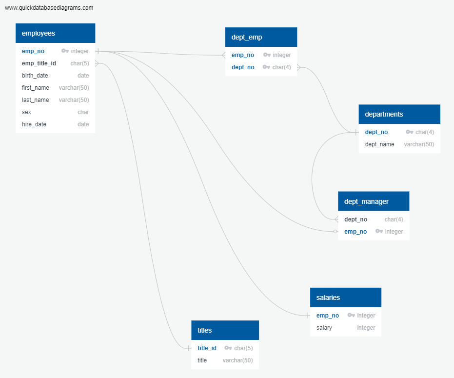

# sql-challenge
Data engineering and data analysis of employee database

Created schema using  http://www.quickdatabasediagrams.com

sketched out an ERD of the tables:

imported tables into the database in the following order:

1. titles
2. employees
3. departments
4. salaries
5. dept_manager
6. dept_emp

